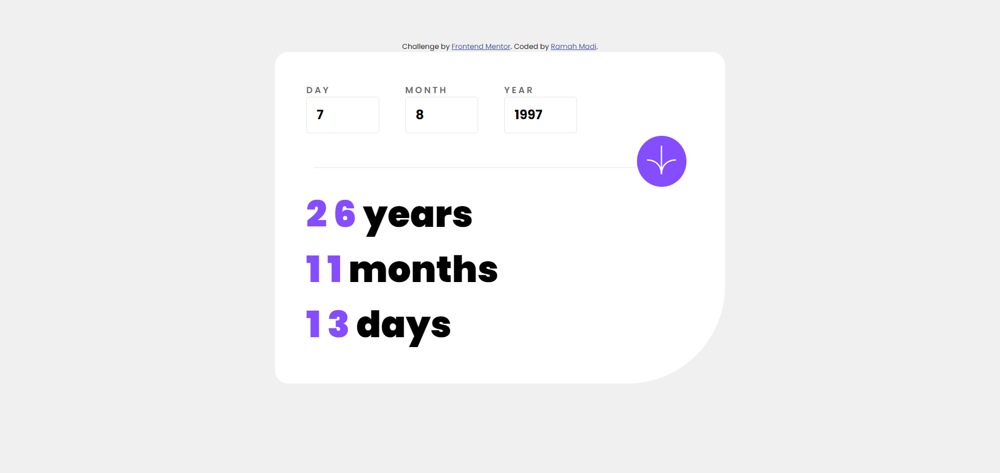

# Frontend Mentor - QR code component solution

This is a solution to the [QR code component challenge on Frontend Mentor](https://www.frontendmentor.io/challenges/qr-code-component-iux_sIO_H). Frontend Mentor challenges help you improve your coding skills by building realistic projects. 

## Table of contents

- [Overview](#overview)
  - [Screenshot](#screenshot)
  - [Links](#links)
  - [Built with](#built-with)

## Overview

### Screenshot

### Links

- Solution URL: [https://www.frontendmentor.io/solutions/responsive-age-calculator-using-css-flexbox-Cc2oCbPJ-z]()
- Live Site URL: [https://github.com/ramah-madi/Age-Calculator]()

### Built with

- HTML5 markup
- CSS
- JS
- Flexbox
